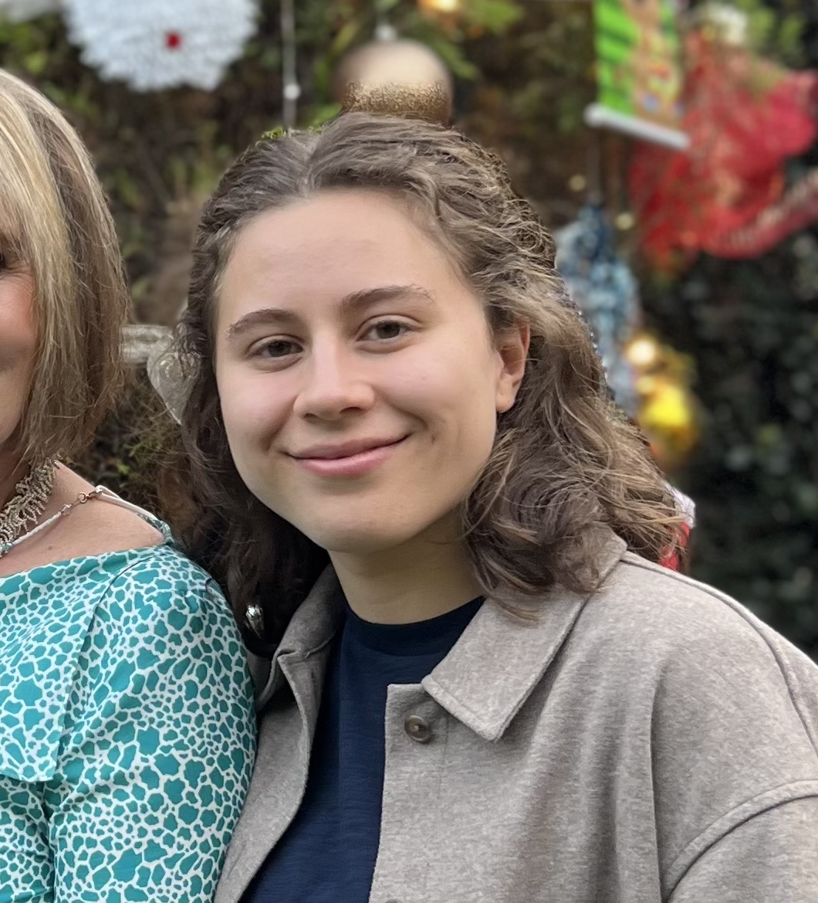

<!-- Main -->

  <!-- One -->
  <section id="one">
    

      <header class="major">
        <h1>About Me</h1>
      </header>
      

        <!-- Profile Picture -->
        

          
        

        <!-- Academic Interests Section -->
        

          <h3>Academic Interests</h3>
          

            My academic journey is rooted in my passion for combining economics and data science to address real-world challenges. At ITAM, where I am pursuing dual bachelor's degrees in Economics and Data Science, I have developed a solid foundation in economic theory and quantitative analysis.
          

          

            Through my coursework and projects, I have explored how data science can drive innovative solutions for pressing issues like environmental conservation and community development. As a research assistant at ITAM, I’ve had the privilege of working on projects that evaluate the impacts of environmental policies and support sustainable development.
          

          

            My fieldwork with ejido communities in Hidalgo was particularly meaningful, as it allowed me to connect directly with people, translating complex policy frameworks into actionable strategies tailored to their needs.
          

          

            I am particularly proud of the projects I’ve undertaken, such as designing Python-based data pipelines for analyzing environmental taxes and economic indicators. These experiences have helped me see the transformative power of technology when applied to societal issues.
          

          

            As an active member of the Data Science Student Council, I’ve enjoyed fostering collaboration and driving meaningful projects among my peers. I also find great fulfillment in giving back through tutoring and offering aid lessons in various subjects, helping others achieve their academic goals.
          

          

            I am excited to continue leveraging my skills to try and make a positive impact.
          

        

      

      <!-- Fun Facts Section -->
      

        <h3>Fun Facts</h3>
        

          I’m passionate about balancing work and fun, with interests that reflect my curiosity and love for connection. My environmental advocacy started young—I participated in a program to "foster" an elephant, supporting efforts to prevent poaching, which deepened my commitment to conservation. I’m also an avid fan of women's football, faithfully cheering for FCB Femení and Arsenal Women, and I’m fascinated by how data analytics can contribute to growing women's sports.
        

        

          In my downtime, I enjoy hiking, immersing myself in nature, and reading historical novels, which fuel my imagination and understanding of the past. These hobbies remind me of the importance of balance, resilience, and pursuing what I love, both personally and professionally. 
        

        

          I absolutely love going to festivals and concerts—it’s one of my favorite ways to unwind and immerse myself in music and culture. Whether it’s a small local event or a large international festival, I enjoy the energy of live performances and the connection it fosters with others who share the same passion. Each experience, from discovering new artists to enjoying the atmosphere, leaves me inspired and energized. Music has always been a big part of my life, and attending these events allows me to combine my love for it with my curiosity about different cultures and artistic expressions.
        

      

    

  </section>

